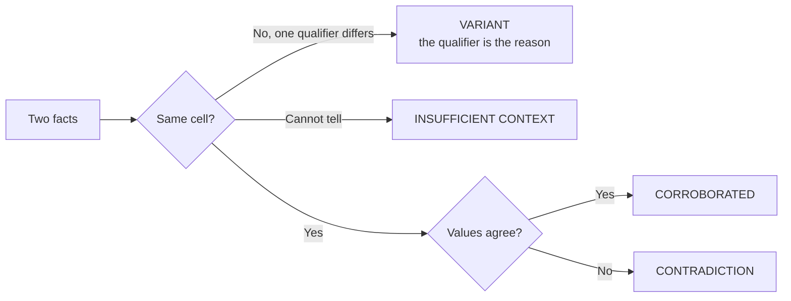
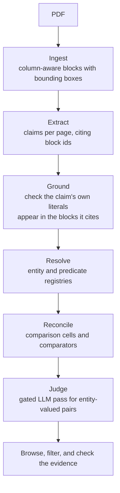
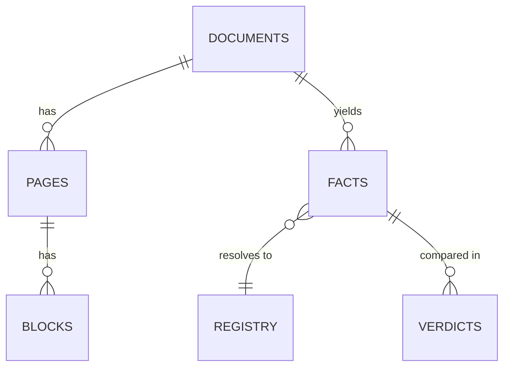

# Albatross

A fact knowledge layer over PDFs. It reads documents page by page, turns them
into atomic claims linked to the exact place on the page they came from, works
out which claims are about the same thing, and then decides whether they agree,
disagree, or only appear to disagree.

The interesting decision in this system is when **not** to call something a
contradiction.

---

## The one idea

Two numbers that differ are not in conflict unless they are measuring the same
thing under the same conditions.

Every fact lands in a **comparison cell**: an entity, a predicate, and the
qualifiers that matter for that predicate. Comparison only happens inside a
cell.



Delhivery's FY24 revenue is 74,540.82 million rupees standalone and 81,415.38
million consolidated. Those differ by 6.9 billion rupees and are both correct.
The `basis` qualifier puts them in different cells, so the system reports a
variant and names `basis` as the reason. No rule anywhere mentions revenue, or
consolidation, or time.

---

## Pipeline



### What each stage does

**Ingest** reads each page with PyMuPDF as layout blocks that keep their
bounding boxes, splits any block straddling a column boundary, and hashes the
page content. The hash is what makes re-ingestion free.

**Extract** sends one page at a time to an LLM as `[block_id x0,y0 x1,y1] text`
lines. The model resolves layout itself and cites the block ids it used. A
claim citing a block that does not exist is dropped.

**Ground** checks that the numbers and dates a claim asserts actually appear in
the blocks it cited. Citing the right block does not mean reading it correctly.

**Resolve** clusters surface forms into entity and predicate registries by
embedding similarity, with two gates: forms containing different digits never
merge, and forms whose observed units are incompatible never merge.

**Reconcile** groups facts by entity and predicate, works out which qualifiers
actually distinguish facts in that group, and compares within cells.

**Judge** handles what arithmetic cannot. "Serves as Non-Executive Nominee
Director" and "resigned from the Board with effect from August 24, 2023" have
different predicates, so no cell ever brings them together. A gated LLM pass
labels those pairs.

---

## What is stored



The schema is small and contains no domain vocabulary. `predicate` and every
qualifier key are free text, so a document about a subject the system has never
seen needs no migration. Ingesting the macroeconomy corpus after the logistics
corpus grew the registries from 85 to 185 entities and 216 to 292 predicates
with no code change.

| table | holds |
|---|---|
| `documents` | source file, content hash, document context card |
| `pages` | physical index, printed page labels, content hash, route |
| `blocks` | bounding box and text for every layout block |
| `facts` | claim, subject, predicate, object, qualifiers, cited block ids |
| `registry` | entity and predicate clusters with their surface forms |
| `verdicts` | pairwise results with delta, tolerance, and reason code |

---

## Stack

| layer | choice | why |
|---|---|---|
| PDF reading | PyMuPDF | blocks with bounding boxes, which the grounding depends on |
| Storage | SQLite, stdlib | about 1,000 facts. Postgres would cost the reader a container before they saw anything |
| Vectors | 768-dim Gemini embeddings, JSON in SQLite, numpy cosine | brute force over 1,000 vectors takes about 20 ms. An index earns its keep near a million |
| Extraction | `gemini-3.5-flash-lite` | free tier, high daily request allowance |
| Pair judge | `gemini-3.8-flash` | falls back to flash-lite on 429 or 503 |
| API and UI | FastAPI, Jinja2, uvicorn | one process, no build step |

Four runtime dependencies. No SDK for the model API, because the whole surface
is one HTTP POST.

---

## Setup

Python 3.11 or newer.

```bash
python -m venv .venv
.venv/Scripts/activate          # Windows
# source .venv/bin/activate     # macOS, Linux
pip install -e .
```

That installs the dependencies and puts an `albatross` command on your path.

Get a free Gemini key from [Google AI Studio](https://aistudio.google.com/apikey),
no card required, and put it in `.env`:

```
GEMINI_API_KEY=your_key_here
```

### Run the pipeline

```bash
albatross ingest data/delhivery/02-delhivery-annual-report-fy24-excerpt.pdf --first 20 --last 28
albatross extract
albatross resolve
albatross reconcile --judge
albatross serve
```

Then open http://127.0.0.1:8000. `albatross status` prints what is in the layer
at any point.

### Running it without an API key

Two databases are committed so the system can be evaluated offline.

`albatross.db` is the built knowledge layer over all six documents.
`albatross serve` works with no key, and so does every page and endpoint,
including the evidence crops, which are rendered from the PDFs rather than
stored.

`.llm-cache.db` holds the 82 model responses and 729 embeddings from the run
that built it, keyed by prompt. With it present, `albatross resolve` and
`albatross reconcile` also run with no key, in about three seconds, so the
clustering and comparison logic can be changed and re-run offline.

Rebuilding from an empty database does need a key, for the six document
context cards. Those are derived from whichever pages were ingested first, so
their prompts do not match what is cached. Everything else replays.

New extraction costs roughly one request per page and self-throttles to one
every 4.5 seconds, so 30 new pages takes about three minutes.

---

## The four cases

### 1. Corroborated across documents

The annual report says revenue was `81,415.38` million rupees. The earnings
deck says `8,142 Cr`. Different documents, different words, different unit
scales.

Normalised, these are 81,415,380,000 and 81,420,000,000. They differ by
4,620,000 rupees, which sounds like a lot until you notice that "8,142 Cr"
asserts nothing below one crore. Tolerance comes from the precision each source
printed, not a fixed epsilon: 5,000,000 from the crore figure plus 5,000 from
the two decimal places of a million. The difference falls inside it.

Verdict `CORROBORATED`, at 92% of the allowed tolerance.

### 2. A likely contradiction

The system found none, in either corpus, and that is the honest result.

It considered twelve candidates from the macroeconomy documents and rejected
all twelve. Five came from an entity over-merge where "General government
deficit" had absorbed "Central government deficit". Three came from a period
label losing its quarter marker. Two had no stated period on one side. The
remaining two turned out to be case 3 below.

Earlier, the logistics corpus produced 211 numeric contradictions. None had
matching predicate wording on both sides, meaning every one came from two
different metrics the registry had merged. Asserting a contradiction asserts
that two facts measure the same thing, so the system now requires the documents
to have used the same words. All 211 became `INSUFFICIENT_CONTEXT`.

Three audited government filings from one company do not contradict each other.
Reporting 211 conflicts would have been worse than reporting none.

The machinery is proven by test instead:
`test_contradiction_fires_when_one_genuinely_exists` builds two facts in one
cell with the same predicate wording and values outside tolerance, and asserts
the verdict is `CONTRADICTION`.

### 3. An apparent contradiction explained by context

The Economic Survey reports the current account deficit at **1.2 per cent of
GDP in Q2 FY25**. The IMF reports it at **0.2 percent of GDP in 2025Q2**. Two
independent institutions, apparently disagreeing sixfold about the same
quarter.

They are not the same quarter. "Q2 FY25" is an Indian fiscal quarter, July to
September 2024. "2025Q2" is a calendar quarter, April to June 2025. Period
labels now carry a marker for which convention they use, so the verdict is
`VARIANT_EXPLAINED_BY` with reason `QUALIFIER_DIFF:period` and the difference
recorded as `["2025Q2F", "2025Q2C"]`.

The system does not claim to know either convention's month boundaries. It only
refuses to assume a fiscal label and a calendar label are interchangeable.

### 4. An extraction failure

The prospectus lists the board of directors in a table with no ruling lines.
Read with `pdftotext -layout`, the DIN column comes out shifted by two rows, so
every director is assigned another director's identifier. Nothing errors. The
output looks entirely reasonable.

Ground truth was available because the annual report states the same DINs
inline in prose, which is unaffected by table geometry. Sandeep Kumar Barasia is
01432123; the naive read gives that number to Sahil Barua.

Two fixes followed. Blocks are read with their bounding boxes and grouped by
column band, so a name and its DIN are recoverable by geometry rather than by
line order. And `tests/test_extraction.py` now fails if the pairing breaks
again.

A second failure of the same family: a claim recorded Suvir Suren Sujan's
resignation as effective August 04, 2023 while citing the block that reads
"with effect from August 24, 2023". August 04 appears three times elsewhere on
that page. The claim was correctly grounded and factually wrong, which is
exactly what a block citation cannot catch. `grounding.py` now checks that a
claim's own numbers and dates appear in the blocks it cites. About 2.7% of
facts are flagged.

---

## Evidence

Every fact records the blocks it came from, and every block records a bounding
box, so evidence is a picture of the page rather than a quotation of it.

`GET /evidence/{fact_id}.png` renders that region of that page with the cited
blocks outlined, drawn from the PDF at request time. Nothing in a crop passed
through the model.

---

## Interface

| route | what it does |
|---|---|
| `/` | documents, context cards, upload |
| `/verdicts` | filter by verdict, entity, or text. Cross-document pairs first |
| `/verdicts/{id}` | both claims with both page crops and the reasoning |
| `/cells` | the comparison cell drawn as a grid |
| `/facts` | browse claims, filter by entity |
| `/docs` | OpenAPI, with the edge cases of every endpoint |

`/cells` is the one worth opening first. It draws qualifier keys as grid axes,
so the reconciliation logic is spatial: two values in one square disagree, two
values in neighbouring squares differ because of the axis between them. On the
revenue cell the axes come out as period against basis without configuration.

`INSUFFICIENT_CONTEXT` on `/verdicts` is the rejection ledger, which is 343
comparisons the system declined to make and the rule that declined each one.

---

## Approach and trade-offs

The full record is 39 numbered decisions in `docs/decisions.md`, each with its
cost. The ones that shaped the system most:

**Read blocks, never flat text.** Settled by evidence rather than preference,
after the DIN column bug and after finding that the annual report's four-column
layout splices unrelated columns into sentences that were never written.

**Give the model coordinates, not a reading order.** No single order works. A
column-major order fixes the spliced prose but decouples the board table's
names from their DINs. Row-major does the reverse. On this corpus the two are
not separable by geometry, because prose columns share a y coordinate exactly
as table cells do. So the model gets bounding boxes and resolves layout itself.

**Discriminating qualifiers are found by value spread, not frequency.** A
frequency rule dropped `basis`, which put the standalone and consolidated
figures in one cell and reported case 1 as a contradiction. What matters is
whether a key takes more than one value in the group.

**Missing a qualifier is not the same as disagreeing on one.** A key both facts
state differently is an explanation. A key only one of them states is missing
information. Case 1 depends on this: the annual report figure carries `basis`,
the deck figure does not.

**The judge is gated behind a deterministic filter.** Ungated, the corpus has
about 40,000 candidate pairs, which is roughly 40 days of free-tier quota.
Requiring the same entity, different documents, and object similarity above
0.60 cuts 539 cross-document pairs to 50.

**SQLite over Postgres, no vector index.** At 1,000 facts, brute-force cosine
takes about 20 ms. HNSW earns its cost near a million vectors and costs a
grader a container in the meantime.

**The response cache lives in its own file.** It used to share the knowledge
database, so a schema rebuild destroyed every paid-for response. The cache is
the expensive asset. The knowledge layer derived from it is disposable.

### AI tools used

Claude Code (Opus) wrote the implementation across this session, working from a
written architecture document and a decisions log kept as the build progressed.
Gemini models do the extraction, embedding, and pair judging at runtime. Both
are documented in `docs/timeline.md`, which records what was built in each
phase, what broke, and what fixed it.

---

## Limitations and next steps

**Entity over-merge is real and visible.** "Delhivery Limited" absorbed its own
Board of Directors. "Kotak Mahindra Bank" absorbed "Kotak Mahindra Capital
Company". A content-token guard fixes these for names, and it is applied, but
the same guard cannot be applied to predicates without breaking case 1, whose
surface forms sit at cosine 0.721 and share almost no words. Contradiction
density per entity would catch the rest and is not built.

**One threshold is uncomfortably tight.** `Express Parcel revenue` sits at
0.7776 against a 0.78 predicate threshold, so a segment stays out of the total's
cluster by 0.0024. Two independent rules would have to fail for that to produce
a wrong answer, and a test pins the split, but the margin is luck rather than
design. Raising the threshold would tune it to this corpus, which is the thing
the brief warns against.

**Vision routing is designed but not built.** The architecture routes
low-text-coverage pages to a vision model. The prospectus contains a management
org chart whose names and titles exist only as pixels, so the entire
organisational structure is invisible to the current pipeline. This is the
highest-value missing piece.

**Silent restatement is not detected.** A later document quietly printing a
different figure, with no correction language, is indistinguishable from a
genuine disagreement. Detecting it would need revision-history modelling per
predicate.

**Unit parsing is a small table, not a unit system.** It handles the magnitude
and currency words in these documents. A document using an unlisted magnitude
word would fail quietly, which is the failure mode this system is otherwise
built to avoid.

**Nothing learns from feedback.** The architecture specifies an endpoint where
human labels tune per-predicate thresholds. Thresholds are currently constants,
justified by measurement rather than by calibration.

---

## Tests

23 tests across 5 files, all runnable without pytest.

```bash
PYTHONIOENCODING=utf-8 python -B tests/test_extraction.py
PYTHONIOENCODING=utf-8 python -B tests/test_reconcile.py
```

They pin behaviour that broke during the build: the DIN pairing, the spliced
columns, incremental ingestion, the registry merges and splits that must and
must not happen, the four acceptance cases, and the fact that a contradiction
fires when one genuinely exists.

---

## Additional notes

`PYTHONIOENCODING=utf-8` matters on Windows. The corpus is full of rupee signs
and the console encoding will otherwise raise partway through a run.

`docs/trail-run.md` is a hands-on guide to verifying all of this yourself, with
every command executed and its real output pasted underneath. It includes how
to read an embedding vector out of the cache and reproduce a clustering
decision by hand.

The corpus is committed under `data/` so the repository clones and runs without
downloads.
