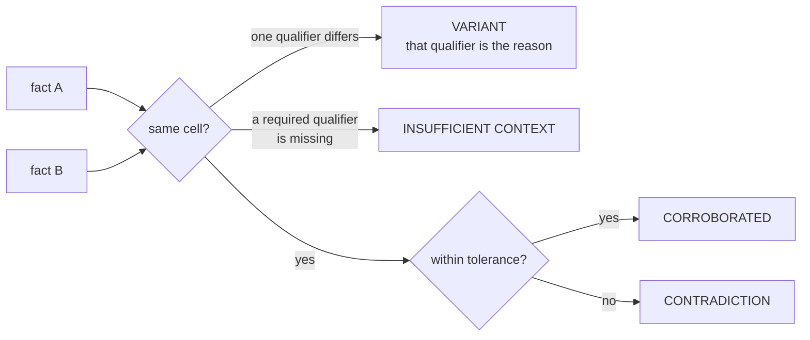
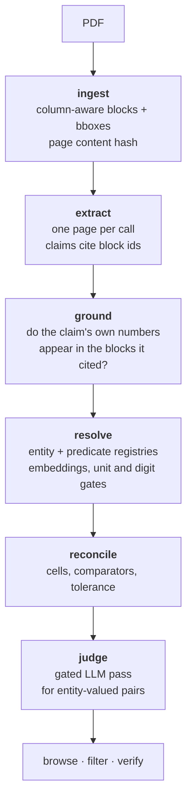
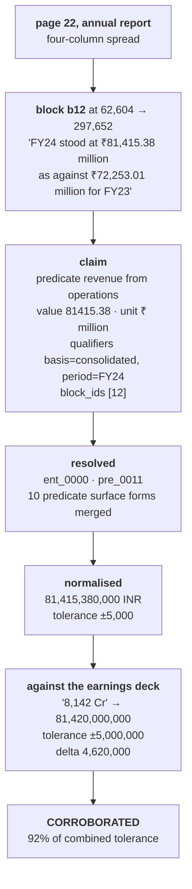
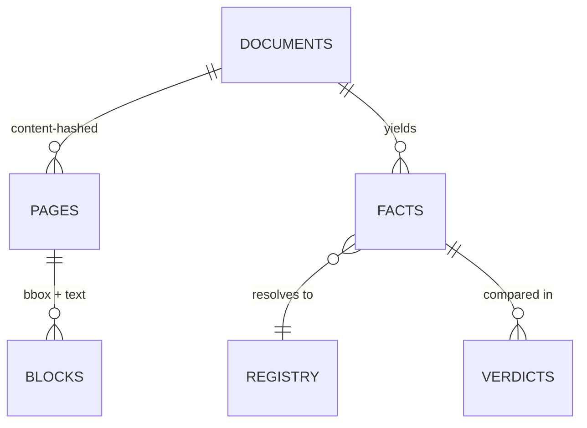

# Albatross

A fact knowledge layer over PDFs. It turns pages into atomic claims anchored to
the pixels they came from, works out which claims are about the same thing, and
decides whether they agree, disagree, or only appear to disagree.

The hard part is the last one. Most figures that look contradictory are not.

https://github.com/user-attachments/assets/d1e123ed-c818-43ab-b7d5-61cc73b717aa

---

## Quick start

```bash
python -m venv .venv && .venv/Scripts/activate    # source .venv/bin/activate on macOS/Linux
pip install -e .
albatross serve
```

Open http://127.0.0.1:8000. The built knowledge layer over six documents ships
in the repo, so nothing above needs an API key.

To ingest something new, put a free [AI Studio](https://aistudio.google.com/apikey)
key in `.env` as `GEMINI_API_KEY=...`, then upload through the UI or run the
pipeline directly:

```bash
albatross ingest report.pdf --first 20 --last 28   # page range optional
albatross extract && albatross resolve && albatross reconcile --judge
```

`albatross status` prints what is in the layer at any point.

---

# Architecture

## The comparison cell

Everything rests on one idea. Two numbers that differ are not in conflict unless
they measure the same thing under the same conditions.

Every fact lands in a **cell**: an entity, a predicate, and the qualifiers that
actually distinguish facts for that predicate. Comparison happens only inside a
cell, and the axes are discovered from the data rather than declared.



One annual report states FY24 revenue twice: 74,540.82 million rupees on a
standalone basis and 81,415.38 million consolidated. Those differ by 6.9 billion
and are both correct. The `basis` qualifier puts them in different cells, so the
verdict is a variant and `basis` is named as the reason. No rule in the codebase
mentions revenue, consolidation, or fiscal years.

`CONTRADICTION` is the hardest verdict to reach, deliberately. Asserting one
asserts that two facts measure the same thing, and the predicate registry
clusters by similarity, so that has to be earned rather than assumed.

## Pipeline



| stage | in | out | model cost |
|---|---|---|---|
| ingest | PDF | blocks with bboxes, page hashes | none |
| extract | one page | claims citing block ids | 1 request/page |
| ground | claim + cited blocks | flags on unsupported literals | none |
| resolve | surface forms | canonical entities and predicates | 1 request/100 forms |
| reconcile | facts | verdicts with delta and tolerance | none |
| judge | gated pairs | verdicts for state changes | 1 request/8 pairs |

Only two stages touch a model, and both cache on the prompt, so a page is paid
for once and never again.

## One fact, end to end

The corroboration case, traced through every stage with its real values.



Two links in that chain matter more than the rest.

The claim cites `b12` and nothing else, so its evidence is a bounding box.
`/evidence/{id}.png` crops exactly that region of exactly that page. Evidence is
a picture of the source, not a quotation of it.

Tolerance is derived, not configured. `8,142 Cr` asserts nothing finer than one
crore, so it carries ±5,000,000. The annual report prints two decimals of a
million, so it carries ±5,000. Their sum is what stops rounding from becoming
disagreement. A fixed epsilon would need tuning per predicate to do the same job.

## Why blocks, not text

`pdftotext -layout` on the prospectus board table returns the identifier column
shifted by two rows. Every director receives another director's number, and
nothing errors.

```
director 2                        01432123    ← belongs to director 3
director 3                        09431299    ← belongs to director 4
```

No single reading order fixes this. Column-major repairs the annual report's
spliced four-column prose but decouples the table's names from their
identifiers. Row-major does the reverse. On this corpus the two layouts are not
separable by geometry, because prose columns share a y coordinate exactly as
table cells do.

So the extractor is handed coordinates instead of an order:

```
[b9  77,585 267,605] <name> / Chairman and Non-Executive Independent Director
[b19 287,585 325,595] 00162957
```

The model resolves the layout and cites the ids back, which is also what grounds
the claim. Verified against the annual report, which states the same identifiers
in prose where table geometry cannot reach them.

## Storage



Six tables, no domain vocabulary. `predicate` and every qualifier key are free
text, so a new kind of fact is new rows rather than a migration. Ingesting three
macroeconomics documents after three corporate filings grew the registries from
85 to 190 entities and 216 to 304 predicates with no code change.

Page content hashes make ingestion incremental. Re-uploading a document adds
nothing, and an overlapping page range adds only what is new.

Verdict ids are derived from the fact pair rather than generated, so a
`/verdicts/{id}` link survives re-running the pipeline.

## Stack

| layer | choice | why |
|---|---|---|
| PDF | PyMuPDF | blocks with bounding boxes, which grounding depends on |
| Storage | SQLite | 1,092 facts. Postgres costs the reader a container before they see anything |
| Vectors | 768-dim embeddings as JSON, numpy cosine | brute force over 1k vectors is ~20 ms. An index earns its cost near a million |
| Extract | `gemini-3.5-flash-lite` | free tier |
| Judge | `gemini-3.8-flash` | falls back on 429 or 503 |
| Web | FastAPI + Jinja2 | one process, no build step |

Four runtime dependencies and no model SDK. The whole model surface is one HTTP
POST.

---

# The four cases

## 1. Corroborated across documents

| | annual report | earnings deck |
|---|---|---|
| as printed | `₹81,415.38 million` | `8,142 Cr` |
| normalised | 81,415,380,000 INR | 81,420,000,000 INR |
| tolerance | ±5,000 | ±5,000,000 |
| evidence | page 22, block b12 | page 10, bar chart |

Delta 4,620,000 against a combined tolerance of 5,005,000. Verdict
`CORROBORATED`, at 92% of what is allowed.

The two sources look nothing alike. One is a sentence in a four-column prose
spread. The other is a labelled bar in a slide chart. They share no wording and
no unit scale, and the match survives only because units are normalised and
tolerance comes from the precision each source printed.

## 2. A likely contradiction

| | prospectus, 2022 | annual report, as on 31 Mar 2024 |
|---|---|---|
| designation | Executive Director and Chief Business Officer | **Whole Time Director** and Chief Business Officer |
| predicate | `designation` | `designation` |
| verdict | `CONTRADICTION` | reason `JUDGE:CONTRADICTION`, cross-document |

The same pattern appears twice, for two different executives. Both sides use the
predicate `designation`, both are entity-valued, and neither document explains
the difference.

The system reports it rather than resolving it. Under the Companies Act a
whole-time director is a kind of executive director, so this is either a formal
re-designation between the two filings or two documents reaching for different
statutory language for one role. Both page crops are attached so a reader can
decide.

Getting to two took work, because the default answer is none:

| candidates | outcome |
|---|---|
| 211 numeric, corporate filings | all rejected. Not one had matching predicate wording, so every one came from two different metrics the registry had merged |
| 12 numeric, three independent institutions | all explained. Five entity over-merges, three lost quarter markers, two unstated periods, two became case 3 |
| 2 entity-valued, cross-document | reported |

`/verdicts?verdict=INSUFFICIENT_CONTEXT` is the rejection ledger: 343
comparisons declined, each carrying the rule that declined it. A unit test also
builds two facts in one cell with identical predicate wording and values outside
tolerance and asserts the verdict is `CONTRADICTION`, so the machinery is pinned
whether or not a corpus happens to contain one.

## 3. An apparent contradiction explained by context

| | Economic Survey | IMF Article IV |
|---|---|---|
| claim | current account deficit 1.2% of GDP | current account deficit 0.2% of GDP |
| stated period | `Q2 FY25` | `2025Q2` |
| evidence | page 30 | page 12 |

Two independent institutions, six times apart, apparently on the same quarter.

They are not the same quarter. `Q2 FY25` is an Indian fiscal quarter, July to
September 2024. `2025Q2` is a calendar quarter, April to June 2025. Period
labels carry a convention marker, so the verdict is `VARIANT_EXPLAINED_BY` with
reason `QUALIFIER_DIFF:period` and the difference recorded as
`["2025Q2F", "2025Q2C"]`.

The system does not claim to know either convention's month boundaries. It only
refuses to assume a fiscal label and a calendar label are interchangeable.

This was a false contradiction until the collision was found. The period
normaliser used to reduce both labels to the same string.

## 4. An extraction failure

**Found.** A claim recorded a resignation as effective **August 04, 2023** while
citing the block that reads *"with effect from August 24, 2023"*. August 04
appears three times elsewhere on that page. The claim was correctly grounded and
factually wrong, which is exactly what a block citation cannot catch.

**Handled.** Every claim's own numbers and date-shaped qualifiers are now
checked against the text of the blocks it cites, and failures are recorded on
the fact rather than dropped. About 2.7% of facts carry a flag, and the UI shows
them.

Calibrating that check produced two false-alarm sources worth naming, because
both would have discredited it:

| bug | effect | fix |
|---|---|---|
| `%.6g` formatting | 74,540.82 and 74,540.83 collapsed to one string, hiding the near-misses the check exists to find | 10 significant digits |
| accounting notation | `(8,987.45)` flagged every loss line in the corpus | parenthesised figures read as negative |

False-alarm rate fell 14.0% → 4.5% → 1.0%.

**Would improve.** The check passes when a claim over-cites. If it includes a
block that happens to contain the wrong literal, the literal is "supported". It
bounds sloppiness rather than eliminating it.

---

## Decisions

Each of these was taken with a cost accepted, not avoided:

| decision | cost |
|---|---|
| Coordinates to the model, not a reading order | more tokens per page |
| Discriminating qualifiers found by value spread, not frequency | a frequency rule dropped `basis` and inverted case 1 into a contradiction |
| Missing a qualifier is not disagreeing on one | more `INSUFFICIENT_CONTEXT`, fewer confident answers |
| Contradiction requires identical predicate wording | genuine contradictions phrased differently are missed |
| Judge gated behind entity, document, and similarity filters | 40,000 pairs cut to 50, and recall now rides on one threshold |
| SQLite, no vector index | needs rebuilding above roughly 1M facts |
| Response cache in its own file | it once shared the knowledge database, and a schema rebuild destroyed every paid response |
| Verdict ids derived from the fact pair | none, and it fixes links that used to break on every run |

Claude Code (Opus) wrote the implementation from a written architecture
document, keeping a decisions log as it went. Gemini does extraction, embedding,
and pair judging at runtime.

---

## Limitations

**Entity over-merge is real and visible.** One canonical entity absorbed its own
board of directors. A bank absorbed a separately incorporated capital company. A
content-token guard fixes names and is applied, but the same guard cannot be
applied to predicates without breaking case 1, whose surface forms sit at cosine
0.721 and share almost no words. Per-entity contradiction density would catch
the rest, and is not built.

**One threshold is uncomfortably tight.** A segment-level revenue predicate sits
at 0.7776 against a 0.78 threshold, so it stays out of the total's cluster by
0.0024. Two independent rules would have to fail for that to produce a wrong
answer and a test pins the split, but the margin is luck rather than design.

**Vision routing is designed, not built.** The prospectus contains a management
org chart whose names and titles exist only as pixels, so an entire
organisational structure is invisible to the pipeline. Highest-value gap.

**Silent restatement is undetectable.** A later document printing a different
figure with no correction language is indistinguishable from a real
disagreement.

**Unit parsing is a table, not a unit system.** It covers the magnitude and
currency words in these documents. An unlisted magnitude word would fail
quietly, which is the failure mode this system otherwise exists to prevent.

**Nothing learns from feedback.** Thresholds are constants justified by
measurement, not calibration.

---

## Tests

23 tests across 5 files, no test runner required.

```bash
python -B tests/test_reconcile.py
```

They pin what broke during the build: the identifier pairing in the board table,
spliced columns, incremental ingestion, the registry merges and splits that must
and must not happen, the four cases, and that a contradiction fires when one
genuinely exists.

---

## Notes

On Windows, prefix commands with `PYTHONIOENCODING=utf-8`. The corpus is full of
rupee signs and the console encoding will otherwise fail partway through a run.

`albatross.db` and `.llm-cache.db` are both committed. The cache holds 91 model
responses and 729 embeddings, so `resolve` and `reconcile` replay offline in
about three seconds. A rebuild from an empty database still needs a key for the
six document context cards, whose prompts depend on ingest order and so miss the
cache.
